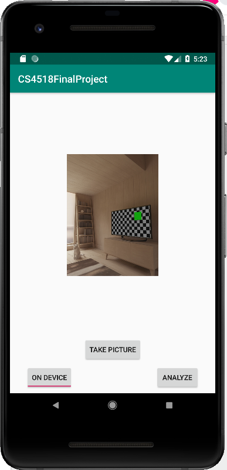
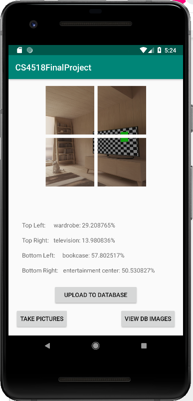
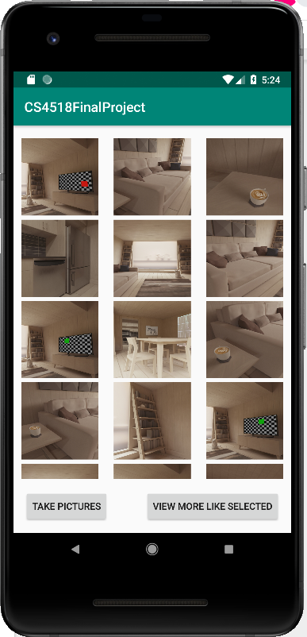

# DESIGN DOCUMENT
#### GROUP MEMBERS
- Hung Hong
- Hannah Jauris

## User Interface Design
The user interface was divided into three different screens. Each of these was in the same activity but implemented each in their own fragment, and were able to swap between each other by invoking methods from the MainActivity to swap them from the container.

### “Take Picture” Fragment

This fragment provides the functionality of taking a picture, selecting whether inference for the image would occur on- or off-device, and the ability to begin the analysis. This was implemented by using implicit intents to let users take pictures when tapping the “Take Pictures” button. Users can select on- or off-device inference by using a ToggleButton, which changes its text to indicate the option that users currently have selected. When tapping the “Analyze” button, the most recently taken image is passed to the “Image Details” fragment by MainActivity, along with whether the ToggleButton is selected for on- or off-device inference.

### “Image Details” Fragment

This fragment shows the image taken in the previous fragment divided into four pieces, along with results of the inference for each quarter. It provides buttons for the user to return to the previous fragment to take more pictures, go to the next fragment showing the images from the database, and to add the given image and its tags to the database. In keeping with the project proposal, the inference is performed separately on four quarters of the original image, to provide more insight about the different parts of the image, and so four TextViews are used to display the most predominant tag for each piece of the image. The image is also displayed with its four pieces, so users know what is included in each portion of the analysis.

The inference on the image’s quarters occurs as soon as the fragment is displayed, since the fragment is displayed as the result of the user tapping the “Analyze” button on the previous fragment. While the inference is in progress, to give the user an indication that calculations are being made, the TextViews where the tags would be shown are set to display the string “Working…”. Once the inference is completed, the user can add the image to the database with the “Add to Database” button. If the user attempts to load the image to the database before the inference is completed, a toast appears, informing the users to wait until the inference is completed before uploading the image. Regardless of whether the user chooses to upload the image, two more buttons are available for them to navigate to the other parts of the app, either back to the “Take Pictures” fragment or to the “Database Images” fragment. 

### “Database Images” Fragment

This fragment displays all of the images on the database, allowing users to scroll through them at their leisure. If a user likes a particular image, they can tap to select it, then hit a “View more like selected” button to re-query the database for only images sharing at least one tag of the selected image. The scrollable view was implemented using RecyclerView, along with the GridLayoutManager, allowing the images to be displayed in a grid, and automatically handling aspects such as scrolling and populating the elements with data. A custom ImageRecyclerAdapter was written to interact with the RecyclerView, allowing for storage of both tags and image-URLs from the database. When the RecyclerView binds the data to a view element, the database is queried for the image, which is then loaded into the view element. To provide feedback to the users, when the user taps an image to select it, the background of that image is changed from transparent to a different color. Only one image can be selected at a time, so if the user taps a different image, the first selected image’s background is changed back to transparent and the new image’s background is changed. This selection also sets whether each element is activated, which allows the “View more like selected” button’s functionality to get the selected element by checking if it is activated. This button then reloads the data in the ImageRecyclerAdapter to only contain references to data with tags matching at least one of the tags in the selected image (this process is described in more detail under Database Design).

## Database Design
In order to store important data from the application process, such as image file and inference results, we choose to make use of Firebase Database and Firebase Storage to manage image data and raw image files, respectively. Specifically, Firebase Database is used to store the DataImage object, which contains variables holding the tags and filename of the image it refers to, and Firebase Storage is used to store the raw image files in the JPEG format. We work with both Database and Storage to maintain communication between our application and the cloud.
Information regarding image data is uploaded when the user clicks on the button “Upload to Database” on the “Image Details” view. The application will store information of the image file name, tags produced from inference process, and time of upload to an object class called DataImage, which is then uploaded to the cloud on Firebase Database. At the same time, the original image that is used for inference (not the images that have been divided for inference) is uploaded to Firebase Storage in JPEG format with its name corresponding to the image name parameter of its associated DataImage object.

Retrieving data from Database and Storage is performed using success listeners, which do not block the UI thread and execute once the query has returned with results. The data from the database, including tags and image names, are stored in a List object of DataImage, which are then used to create the ImageRecyclerAdapter used in the RecyclerView of the “Database Image” fragment. When the RecyclerView attempts to display the images, the adapter calls a function to get the corresponding file from the storage. This call also utilizes a success listener, which, when the image returns, turns the image into a bitmap and loads it into the correct view object.

When the user taps the “View more like selected” button, the list of DataImage objects obtained from the database is used, filtering out any data that does not share at least one tag with the selected image. This is done entirely on-device, rather than performing a new query for the relevant data, since the version of Firebase used, Firebase Firestore, does not support queries with logical OR’s in them, as our query would have to be, since returned images should contain one or more of the selected tags. It was simpler (and likely faster performance-wise) to process the already downloaded data rather than performing as many as four database queries, then sorting through all of the returned data to remove duplicates.

## Inference Design
Inference occurs in the “Image Details” fragment, so all of the functionality for accessing the Tensorflow InceptionV3 model, both on- and off-device, are implemented in that fragment. So the model is only loaded once, the initialization of the model and array of labels for it are performed in the onCreate() method, called when the fragment is being created for the first time. Since the inference should be started as soon as the fragment is loaded, the call to begin the inference is called in the onActivityCreated() method, called when the fragment is to be displayed. So as not to block the loading of the UI portion of the fragment, both on- and off-device processing are handled in an AsyncTask thread. This custom AsyncTask takes the four bitmaps to perform analysis on, and calls a helper function to perform the appropriate analysis (on-device or off-device) on each. Each helper function returns a string array of size two, with the first element containing the tag obtained from the inference, and the second containing the percentage the inference assigned that tag.

#### On-Device Inference
On-Device inference was performed by first scaling the image bitmap to the size required by the model, then further processing the image to normalize the brightness to something closer to what the model was trained on. It then runs the inference on the bitmap and searches through the results for the highest percentage assigned by the model. This is then matched to the label in the labels array, and the label and percentage are returned, to be stored and displayed when the AsyncTask completes.

#### Off-Device Inference
Since the server handles the pre-processing of the bitmap, the pre-processing done in on-device inference is not needed for off-device inference. Instead, it creates a temporary file to store the bitmap in and sends that file in an HTTP request to the server. When it receives the response from the server, the AsyncTask attempts to read the response. If the response is not as expected (such as an empty response, which occurred sometimes during testing), it caught the error and attempted to send the inference request again. On receiving a correct response, the string is parsed into the tag and percentage, then returned to be stored and displayed when the AsyncTask completes.
