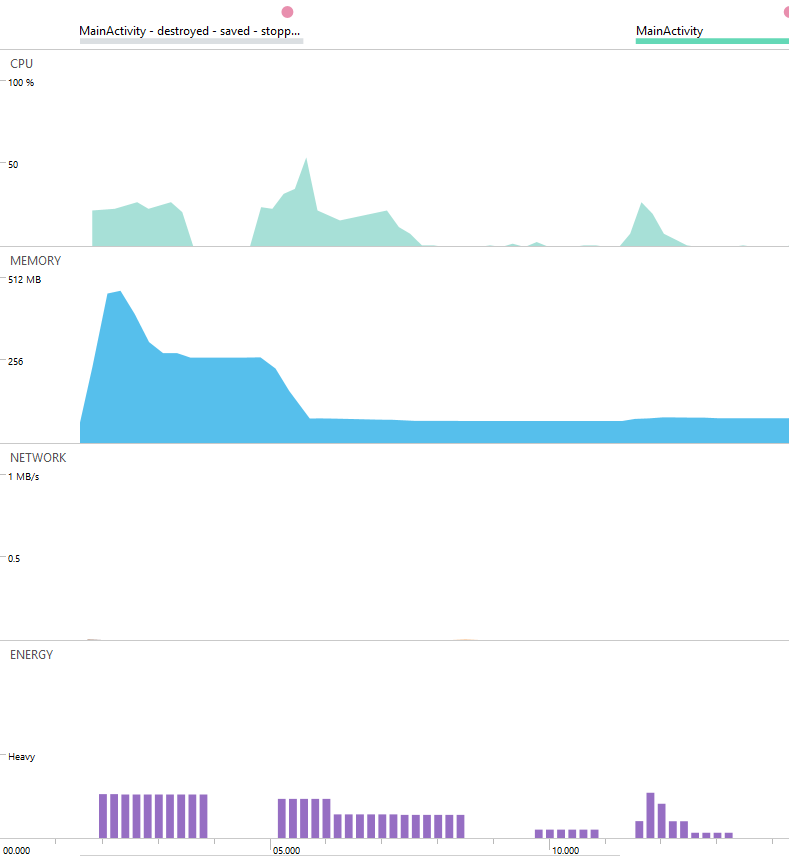
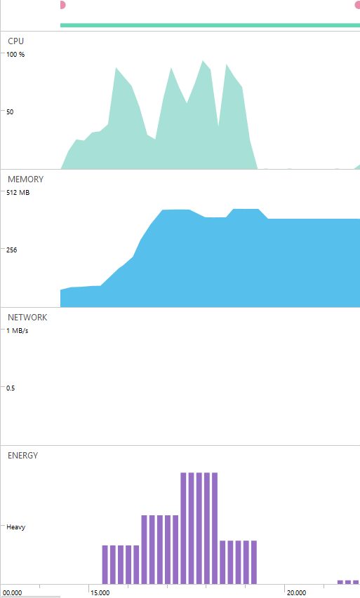
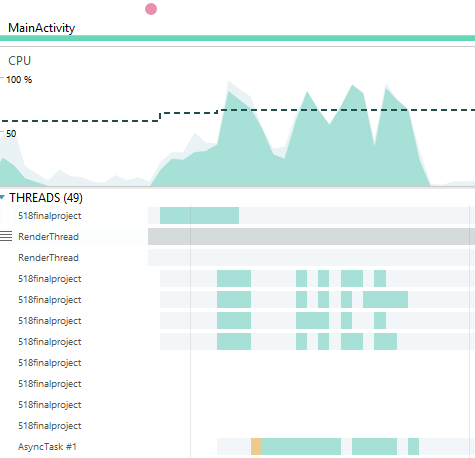
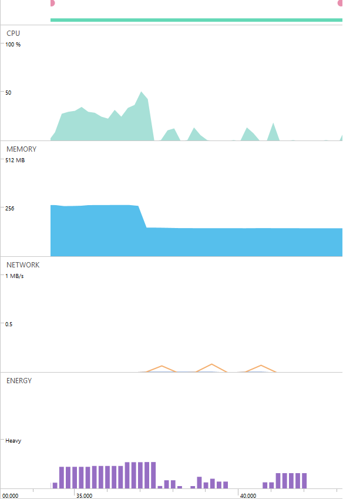
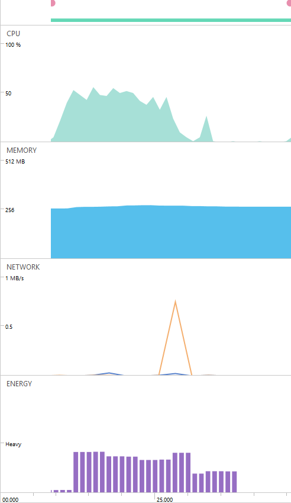
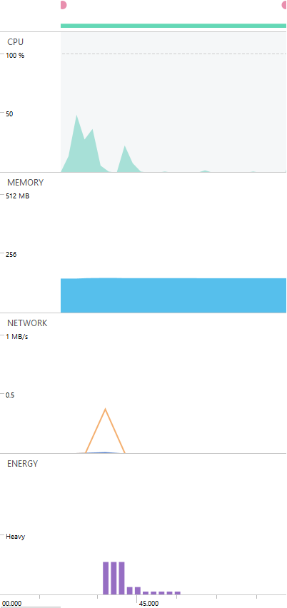
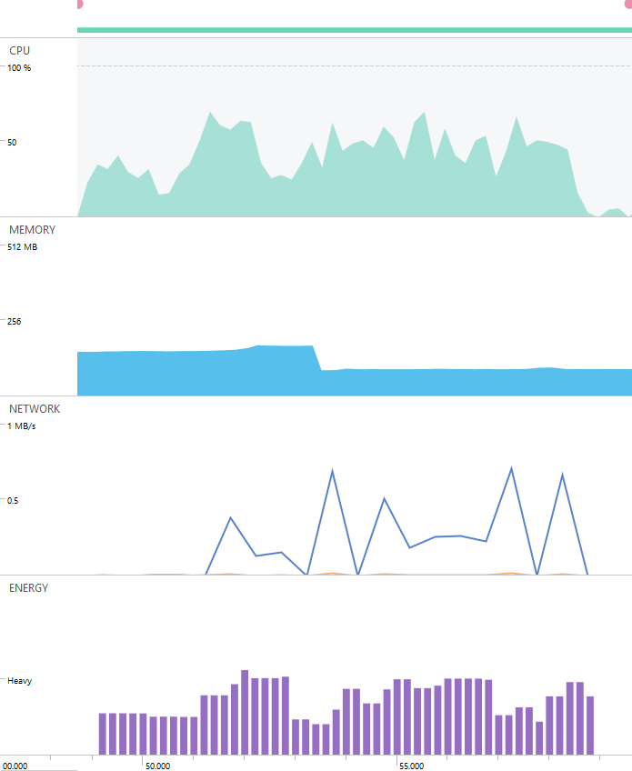
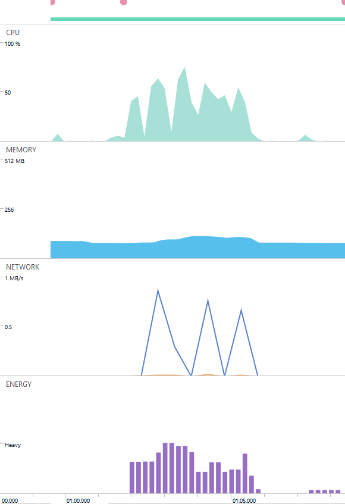
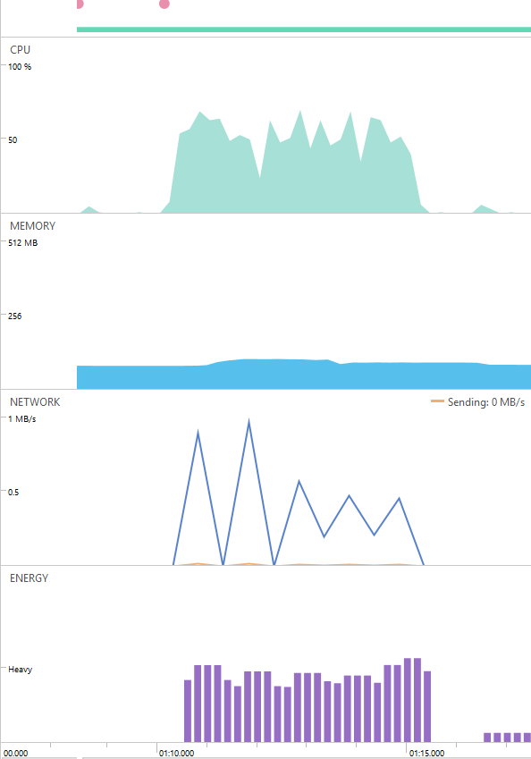
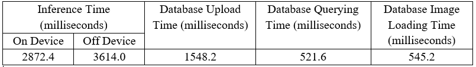

# Performance Report
### Group Members
- Hung Hong
- Hannah Jauris

## Performance Metrics
- **Memory Utilization**: The app’s use of memory was measured using the Memory Utilization metric, which was measured in how many MB of memory were being used by the process at any given moment while the device was running.
- **Energy Consumption**: The energy used by the app was measured using the Energy Consumption metric, which was divided into three categories of light, medium, or heavy energy usage at any given moment while the device was running.
- **CPU Usage**: The processing demands of the app were measured using the CPU usage metric, which was measured by what percentage of the CPU was the application using at any point during its execution. Higher percentages would mean that the application was being more demanding in what processing it needed to complete.
- **Inference Time**: How long the inference took, for both on- and off-device inference, was measured in milliseconds, with the start time being recorded just before the inference for the image quarters began and the end time being recorded just after the final inference finished.
- **Database Querying Time**: How long querying the database for tags and image names took was measured in milliseconds, with the start time being recorded just before the request for the information began and the end time being recorded just after the information was received.
- **Database Image Loading Time**: The time it took to load an image from the database to the application, given the name of the image (obtained in the query for the previous metric) was measured in milliseconds, with the start time being recorded just before the request for the image and the end time being recorded just after the information was received.
- **Database Upload Time**: The time it took to upload an image from the device to the database was measured in milliseconds, with the start time being recorded just before the uploading began and the end time being recorded once the application received that the upload was successful.

## Measurement Methodology
In order to measure the Memory Utilization, Energy Consumption, and CPU Usage by the app over time, Android Studio’s Profiler was utilized, which provided measurements for each of these metrics over the course of the app being run. Network usage was also recorded with the Profiler, although this was only used to recognize when network-based activities, such as off-device inference and interacting with the database, were being performed. The Profiler also recorded when the user interacted with the UI by showing a pale red dot at the top of the output at the time the UI was interacted with, which allowed the entire performance profiling to be divided based on how the user was interacting with the app at that time. The CPU Usage metric was measured using the Profiler’s CPU information (the top bar with green graph output), the Memory Utilization metric with the Memory information in the profiler (the second bar with the blue graph output), and the Energy Consumption metric with Energy information (the bottom bar with purple graph output). The information was obtained by running the app over a period of one minute and fifteen seconds, and engaging in each part of its functionality to gain performance information for each aspect of the app over the entirety of that time.

To measure the metrics involving time, namely Inference Time, Database Querying Time, Database Image Loading Time, and Database Upload Time, the code itself was instrumented to record the start and end times for each of these activities. The difference between these times was taken and printed to Logcat, allowing for the times to be collected afterward and analyzed. To prevent the overhead of these measurements from interfering with the other metrics obtained through the Profiler, the code was instrumented with these measurements after the testing with the Profiler was completed. To obtain a larger sample of times taken for each activity, the app was run and performed the actions for each time-based metric five times, and the averages of each metric were taken.

## Results
### Performance through Application Process: Memory Utilization, CPU Usage, and Energy Consumption Metrics
- Initial startup

*Figure 1: Performance Profile on Initial Startup and Taking Picture*

The first thing we want to investigate is the usage of our application on launch. Based on the data that we obtained through the built-in Android Performance Profiler, we notice that it takes a lot of memory (almost 512 MB) to start the application initially, while CPU usage and Energy usage are not as significant, with around 25% of the CPU being used and medium Energy usage for the application. The rise in memory usage is likely because of the initialization of the fragments used for the application, as well as other UI entities, such as buttons, image views, and texts. The gap in the CPU usage in the second half of the graph is due to the “Take Picture” button being pushed, which started the Camera application, which can be seen by the pale red dot at the top of Figure 1. There is a brief spike in CPU usage shortly after the button is pressed, likely because of the app processing the input and sending the implicit intent to start the Camera app. Since the Camera is a separate app from the one being profiled, that CPU usage does not appear in the Profiler output.

- On-device Inference

*Figure 2: Performance Profile on On-Device Inference*

Based on Figure 2, we noticed a huge rise in CPU, Memory and Energy Usage for the On-Device Inference Process, which was expected because inference is expensive to execute, especially on-device. In the CPU usage, there are four visible spikes in the usage, representing the inference being performed on the four separated parts of the image. Upon closer inspection of the CPU usage, seen in Figure 3, most of the resources are allocated for the AsyncTask background thread which performed the inference. Once the inference is completed, the CPU usage and the Energy consumption fell, although the memory usage remained high.

*Figure 3: In-depth Profile on CPU Usage*

- Off-device Inference

*Figure 4: Performance Profile on Off-Device Inference*

Compared to On-Device Inference, Off-Device Inference does not take as much resources, as seen by the generally lower CPU, Memory, and Energy Usages in Figure 4. This makes sense, as the computationally-expensive inference takes place off of the device: the application only needs to send the information to an external server, which will perform inference process, and the retrieve data returned to display onto the UI. As a result, we can see there has been some outgoing network communications (expressed by the orange line on Figure 4). Similarly to on-device inference, four spikes in CPU usage can be seen, representing the processing related to the four quarters of the image, although the CPU usage is much lower for off-device inference, with below 25% for off-device inference compared to the approximately 75% CPU usage for on-device inference.

- Upload to Database

*Figure 5: Performance Profile on Upload to Database after On-Device Inference*

*Figure 6: Performance Profile on Upload to Database after Off-Device Inference*

At first, we expected that there should be not much difference between uploading after performing on-device inference and off-device inference. However, based on Figure 5 and Figure 6, we can see that the resource spent on uploading data to the database after Off-Device Inference is less than that after On-Device Inference. This can be explained in that for Off-Device Inference, the connection to the Internet has recently been established and the hardware to connect to the Internet is likely still active after the inference. For On-Device Inference, the uploading process still requires connection to the Internet, but the Internet connection may not have been established before the upload, requiring additional resources to start the Internet to connect to the database.

- View Database Images

*Figure 7: Performance Profile on View Storage Images*

When the user displays the final fragment, to display the images from the database, the Firebase Database must be queried for the information about the images, then individually for each image the application attempts to download. As can be seen in the Network section of Figure 7, much information is being received, as indicated by the blue line. Resources are spent on maintaining the connection and loading the images onto our application. This can be seen by the fluctuating graphs of CPU and Energy usage, with the CPR usage, in particular, rising slightly during spikes in times of high amounts of network information being received. As for the Memory Usage, the decrease in Figure 7 can probably be explained as previous memory allocated for inference is relieved over time, hence the sudden drop. It can also be observed that viewing images from the cloud does not take up much memory for our application.

- View similar images

*Figure 8: Performance Profile on View Similar Images on the Cloud #1*

*Figure 9: Performance Profile on View Similar Images on the Cloud #2*

Similarly to when the user views images from the Cloud, tapping the “View similar image” button also requires connection to the Cloud server to retrieve necessary image data as the images being shown are filtered by tag. The process of filtering data using the image tags also require CPU and Energy Usage, as shown by the fluctuation of the graph on both Figure 8 and Figure 9. This process, similar to Viewing Database Images from the Cloud, does not take significant memory usage, as seen by a very small variation on the Memory Usage stats.

### Time-Based Metric Performance

*Table 1: Average Time Performance Across Multiple Metrics, in milliseconds*

Table 1 shows the average times obtained for the Inference Time, Database Upload Time, Database Query Time, and Database Image Loading Time metrics, through methods described in the Measurement Methodology sections. In the first column are the average times taken for both on- and off-device inference. Interestingly, even though the off-device inference is being performed on the server, which has more power and resources to likely perform the actual inference faster, the on-device inference is actually, on average, almost 800 milliseconds faster. This is potentially due to the inference being performed four times, one for each quarter of the image taken, which means that the off-device inference must send four requests for inference. Further, if the network connection encounters problems and another request must be made to analyze part of the image, this is yet another network request being made. Due to the multiple requests, the overheads of the network connection is exaggerated, likely resulting in the on-device inference being faster.

The Database Upload Time metric’s average was approximately 1,548 milliseconds. This is almost triple the time it takes to retrieve an image or fetch all of the DataImage objects (containing information pertaining to an image, such as its name on the database and tags the inference associated with it) from the database. This significant increase in time could be due to the Upload Time metric uploading two things: the actual image and the DataImage object that references it, whereas the retrieval metrics are only returning results of one query, not two. The Database Querying Time metric and Database Image Loading metric are approximately the same, with the averages only being off by just over 20 milliseconds, showing that it takes a similar amount of time for the database to retrieve one image as it does to send all of the entries of DataImage objects on the database. However, as the number of database entries grows, the Database Querying Time would likely increase, as it would take longer to send all of the data back to the application. Overall, inference is the most time-costly of the measured metrics, with the database queries being the least time-costly.

## Summary
Overall, the Inference portion of the application used the most time and resources to perform. While it was less straining on the device’s resources to perform the inference off-device, the repeated inferences and overhead of communication via network connection also made it take longer than on-device inference. Initializing the app also used a significant amount of resources, but was done with the resources much sooner than the inference process was. Retrieving information and images from the database were relatively quick actions compared to uploading to the database, and the resources required to filter and display them were still less than the inference. Despite the need for frequent network connections with the database, the most expensive part of the application, in terms of both time and device resources, was the inference. If the user wanted inference to be completed faster, they could use on-device inference, but if the user cared more about the strain on their device’s resources, off-device inference would be the better option.
